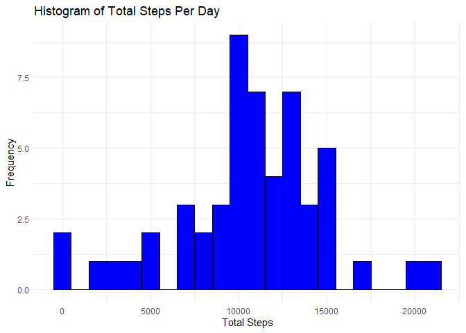
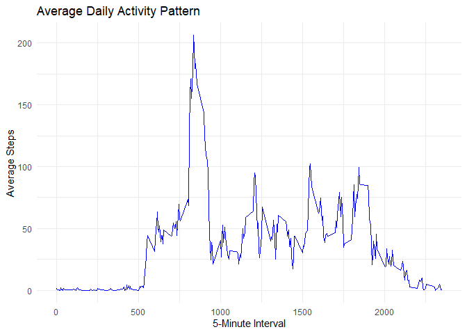
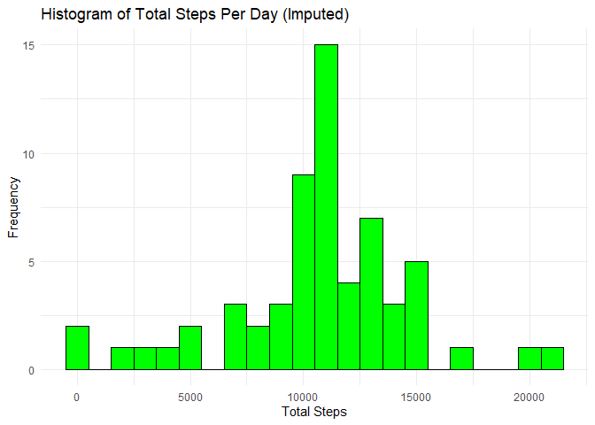
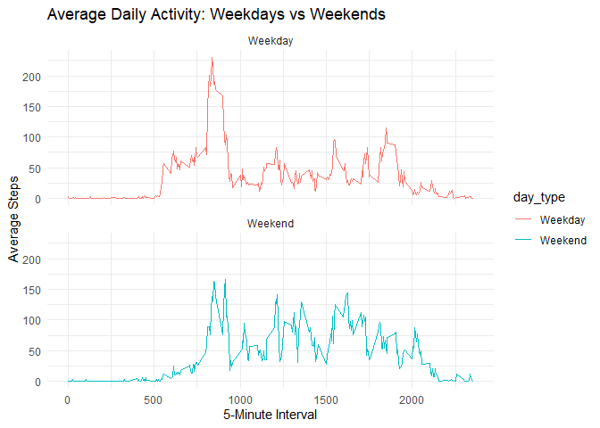

## Loading and preprocessing the data

``` r
# Load the data
data <- read.csv("activity.csv")

# Convert date column to Date type
data$date <- as.Date(data$date)
```


## What is mean total number of steps taken per day?

#### Calculate Total Steps Per Day

``` r
# Aggregate total steps per day, ignoring NAs
total_steps_per_day <- aggregate(steps ~ date, data, sum, na.rm = TRUE)
```

#### Plot Total Steps Per Day

``` r
# Plot histogram of total steps
ggplot(total_steps_per_day, aes(x = steps)) +
  geom_histogram(binwidth = 1000, fill = "blue", color = "black") +
  theme_minimal() +
  labs(title = "Histogram of Total Steps Per Day", x = "Total Steps", y = "Frequency")
```

<!-- -->

#### Mean and Median

``` r
# Calculate mean and median
mean_steps <- mean(total_steps_per_day$steps)
median_steps <- median(total_steps_per_day$steps)

mean_steps
```

```
## [1] 10766.19
```

``` r
median_steps
```

```
## [1] 10765
```

## What is the average daily activity pattern?

#### Average Steps Per Interval


``` r
# Calculate average steps per interval
average_steps <- aggregate(steps ~ interval, data, mean, na.rm = TRUE)

# Plot time series
ggplot(average_steps, aes(x = interval, y = steps)) +
  geom_line(color = "blue") +
  theme_minimal() +
  labs(title = "Average Daily Activity Pattern", x = "5-Minute Interval", y = "Average Steps")
```

<!-- -->

#### Interval with Maximum Steps

``` r
# Find the interval with the maximum average steps
max_interval <- average_steps[which.max(average_steps$steps), ]
max_interval
```

```
##     interval    steps
## 104      835 206.1698
```


## Imputing missing values

#### Total Missing Values

``` r
# Count missing values
total_missing <- sum(is.na(data$steps))
total_missing
```

```
## [1] 2304
```

#### Fill Missing Values

``` r
library(dplyr)
```

```
## Warning: package 'dplyr' was built under R version 4.4.2
```

```
## 
## Attaching package: 'dplyr'
```

```
## The following objects are masked from 'package:stats':
## 
##     filter, lag
```

```
## The following objects are masked from 'package:base':
## 
##     intersect, setdiff, setequal, union
```

``` r
data_filled <- data %>%
  group_by(interval) %>%
  mutate(steps = ifelse(is.na(steps), mean(steps, na.rm = TRUE), steps))
```

#### Histogram After Imputation

``` r
# Recalculate total steps per day
total_steps_filled <- aggregate(steps ~ date, data_filled, sum)

# Plot histogram
ggplot(total_steps_filled, aes(x = steps)) +
  geom_histogram(binwidth = 1000, fill = "green", color = "black") +
  theme_minimal() +
  labs(title = "Histogram of Total Steps Per Day (Imputed)", x = "Total Steps", y = "Frequency")
```

<!-- -->

``` r
# Recalculate mean and median
mean_steps_filled <- mean(total_steps_filled$steps)
median_steps_filled <- median(total_steps_filled$steps)

mean_steps_filled
```

```
## [1] 10766.19
```

``` r
median_steps_filled
```

```
## [1] 10766.19
```


## Are there differences in activity patterns between weekdays and weekends?

#### Create Weekday/Weekend Variable

``` r
# Add weekday/weekend classification
data_filled$day_type <- ifelse(weekdays(data_filled$date) %in% c("Saturday", "Sunday"), 
                               "Weekend", "Weekday")
```

#### Average Steps by Day Type

``` r
# Aggregate by interval and day type
average_steps_by_day <- aggregate(steps ~ interval + day_type, data_filled, mean)

# Plot time series by day type
ggplot(average_steps_by_day, aes(x = interval, y = steps, color = day_type)) +
  geom_line() +
  facet_wrap(~ day_type, ncol = 1) +
  theme_minimal() +
  labs(title = "Average Daily Activity: Weekdays vs Weekends", 
       x = "5-Minute Interval", y = "Average Steps")
```

<!-- -->
